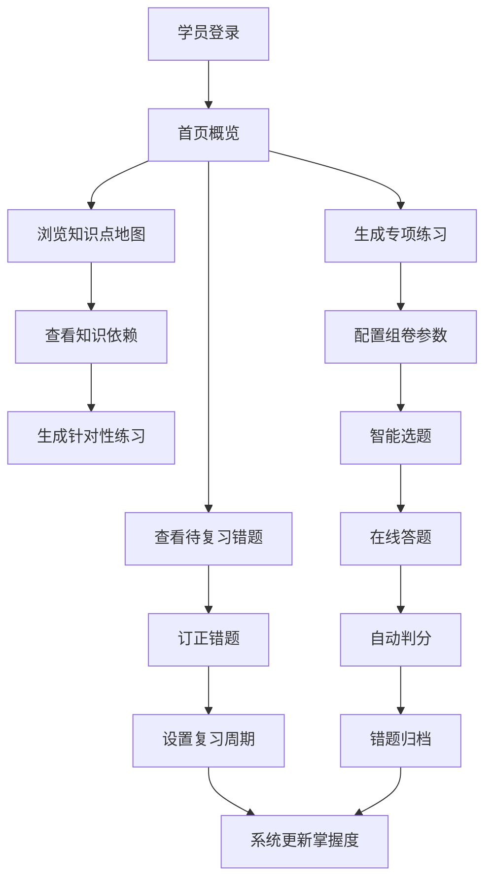

## 1. 产品概述

错题知识图谱 Web 应用是一款面向培训机构的智能备考管理系统，旨在帮助教师高效跟踪学员学习效果，通过知识图谱技术实现错题的智能分类、知识点关联分析和个性化练习推荐。

- **核心价值**：将学员错题转化为可量化的知识图谱，精准定位薄弱环节，实现针对性教学和个性化复习
- **目标用户**：培训机构教师、学员、家长
- **解决问题**：传统错题整理效率低、知识点关联不清晰、复习针对性不强、教学效果难以量化追踪

## 2. 核心功能

### 2.1 用户角色

| 角色 | 注册方式 | 核心权限 |
|------|----------|----------|
| 学员 | 机构批量导入 | 查看个人错题、知识点地图、组卷练习、个人进步曲线 |
| 教师 | 机构管理员创建 | 全部功能，含导入考试结果、知识点维护、批量标签调整、讲评任务推送 |
| 家长 | 学员关联邀请 | 查看学员学习报告、接收沟通报告 |

### 2.2 功能模块

1. **学员首页**：个人学习概览、错题统计、待复习提醒、近期进步
2. **错题库**：错题列表、错因筛选、订正状态管理、复习周期设置
3. **知识点地图**：知识点层级展示、前后依赖关系、掌握度热力图
4. **组卷练习**：按知识点/错因/难度智能组卷、专项练习生成
5. **教师工作台**：讲评任务推送、批量标签调整、考试结果导入
6. **统计报表**：班级掌握度对比、个人进步曲线、家长沟通报告导出

### 2.3 页面详情

| 页面名称 | 模块名称 | 功能描述 |
|----------|----------|----------|
| 学员首页 | 数据概览卡片 | 展示错题总数、待订正数、本周复习量、掌握率 |
| 学员首页 | 近期进步曲线 | 显示近30天的正确率趋势图 |
| 学员首页 | 待复习提醒 | 列出到期需要复习的错题，支持一键开始复习 |
| 学员首页 | 薄弱知识点 | 展示掌握度最低的5个知识点，快速跳转练习 |
| 错题库 | 筛选工具栏 | 支持按科目、知识点、错因、订正状态、时间范围筛选 |
| 错题库 | 错题卡片列表 | 展示题目内容、错误答案、正确答案、错因标签、订正状态 |
| 错题库 | 订正操作面板 | 标记订正状态、添加笔记、设置下次复习时间 |
| 错题库 | 复习周期设置 | 自定义艾宾浩斯复习间隔，或选择预设周期 |
| 知识点地图 | 层级树导航 | 可展开/收起的知识点层级结构，支持搜索定位 |
| 知识点地图 | 图谱可视化 | 节点代表知识点，连线代表依赖关系，颜色表示掌握度 |
| 知识点地图 | 依赖关系面板 | 选中节点后展示前置知识和后续知识 |
| 知识点地图 | 掌握度热力图 | 按章节/模块展示知识点掌握情况 |
| 组卷练习 | 组卷参数配置 | 选择知识点范围、题目数量、难度分布、题型比例 |
| 组卷练习 | 试卷预览 | 生成试卷前预览题目分布和知识点覆盖 |
| 组卷练习 | 答题界面 | 支持在线答题、即时判分、错题自动归档 |
| 组卷练习 | 练习报告 | 完成后展示正确率、知识点分析、推荐复习内容 |
| 教师工作台 | 考试结果导入 | 支持Excel/CSV批量导入考试成绩，自动识别错题 |
| 教师工作台 | 批量标签管理 | 多选题目批量调整知识点标签、错因标签 |
| 教师工作台 | 讲评任务中心 | 查看待讲评题目、推送讲评任务给学员、记录讲评记录 |
| 教师工作台 | 知识点维护 | 新增/编辑/删除知识点、调整层级关系、设置依赖 |
| 统计报表 | 班级掌握度对比 | 多班级柱状图对比各知识点掌握率 |
| 统计报表 | 个人进步曲线 | 展示学员各阶段的成绩和知识点掌握趋势 |
| 统计报表 | 错题分布分析 | 按知识点、错因、题型的多维度饼图/柱状图 |
| 统计报表 | 家长报告导出 | 生成PDF格式的学习报告，含成绩、分析、建议 |

## 3. 核心流程

### 3.1 教师导入考试流程
教师登录 → 进入教师工作台 → 选择考试结果导入 → 上传Excel/CSV文件 → 系统自动识别错题并归类知识点 → 预览导入结果 → 确认导入 → 错题库自动更新

### 3.2 学员错题订正流程
学员登录 → 首页查看待订正提醒 → 进入错题库 → 筛选未订正题目 → 查看题目和解析 → 完成订正 → 标记订正状态 → 设置下次复习时间 → 系统更新掌握度

### 3.3 知识点学习流程
学员/教师进入知识点地图 → 搜索或浏览知识点 → 查看知识图谱和依赖关系 → 点击薄弱知识点 → 查看关联错题 → 生成专项练习 → 完成练习 → 掌握度更新

### 3.4 组卷练习流程
进入组卷练习页面 → 配置组卷参数（知识点、题量、难度） → 系统智能选题 → 预览试卷 → 开始答题 → 提交判分 → 查看练习报告 → 错题自动归档

## 4. 用户界面设计

### 4.1 设计风格

**设计理念**：学术科技风，结合数据可视化的专业感和教育产品的亲和力

- **主色调**：深海蓝 `#1e3a5f` — 代表专业、知识、深度思考
- **辅助色**：科技青 `#00d4aa` — 代表进步、正确、活力；警示橙 `#ff9500` — 代表待处理、复习提醒
- **中性色**：以灰白为主，`#f8fafc` 背景，`#1e293b` 正文，保证阅读舒适度
- **字体**：标题使用 Noto Serif SC（衬线体，学术感），正文使用 Noto Sans SC（无衬线，易读性）
- **按钮风格**：圆角 8px，悬停有轻微上浮和阴影效果，主按钮使用渐变填充
- **布局风格**：卡片式布局，信息分层清晰，左侧导航 + 顶部工具栏 + 主内容区的经典后台布局
- **图标风格**：使用 lucide-react 线性图标，保持简洁统一

### 4.2 页面设计概览

| 页面名称 | 模块名称 | UI 元素 |
|----------|----------|---------|
| 学员首页 | 数据概览卡片 | 渐变色背景卡片，大数字展示，图标动画，悬浮效果 |
| 学员首页 | 进步曲线图 | 平滑折线图，渐变填充区域，数据点悬浮提示 |
| 错题库 | 筛选工具栏 | 标签式筛选，下拉选择器，搜索框，日期范围选择 |
| 错题库 | 错题卡片 | 题号标签，知识点标签，错因标签，状态徽章，展开/收起动画 |
| 知识点地图 | 图谱可视化 | 力导向图布局，节点拖拽，缩放平移，节点点击高亮关联 |
| 知识点地图 | 层级树 | 可折叠树状结构，掌握度颜色条，搜索高亮 |
| 组卷练习 | 参数配置 | 滑块选择器，标签多选，实时预览题量分布环形图 |
| 教师工作台 | 批量操作 | 复选框选择，批量操作工具栏，进度条提示 |
| 统计报表 | 对比图表 | 分组柱状图，支持切换维度，数据导出按钮 |

### 4.3 响应式设计

- **桌面优先**：针对 1280px 及以上分辨率优化，三栏布局
- **平板适配**：992px - 1280px，收起侧边导航为图标模式
- **手机适配**：768px 以下，底部 Tab 导航，卡片单列布局，图谱简化为列表模式
- **触摸优化**：按钮最小尺寸 44px，支持滑动操作，图表支持触摸缩放

### 4.4 动效与交互

- **页面加载**：内容区域淡入，卡片依次上浮出现（stagger 动画）
- **数据更新**：数字滚动动画，图表重绘过渡
- **错题卡片**：展开/收起的平滑高度过渡
- **知识图谱**：节点悬停放大，连线高亮，关联节点脉冲提示
- **按钮交互**：点击缩放反馈，表单输入焦点状态变化
