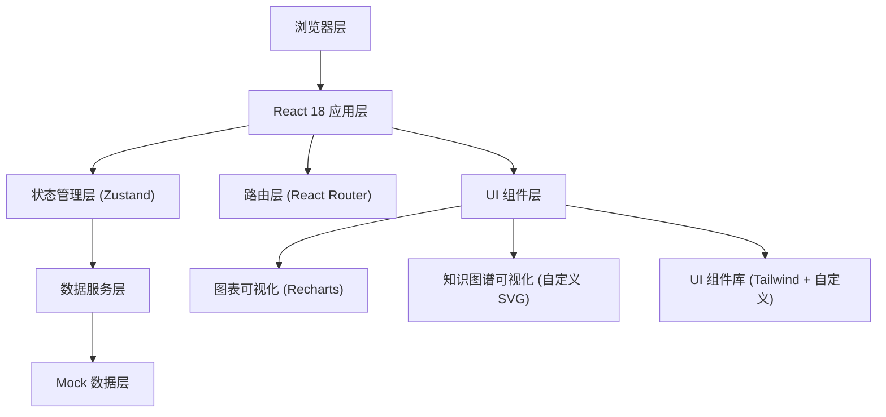

## 1. 架构设计

本系统采用前后端分离的纯前端架构，使用 React 构建单页应用，通过 Zustand 管理全局状态，内置 Mock 数据支持完整功能演示。



## 2. 技术描述

- **前端框架**：React 18 + TypeScript
- **构建工具**：Vite 5
- **样式方案**：Tailwind CSS 3.4
- **状态管理**：Zustand 4
- **路由管理**：React Router DOM 6
- **图表库**：Recharts 2
- **图标库**：Lucide React
- **后端**：无（纯前端 Mock 数据）
- **数据库**：LocalStorage 持久化 + 内存 Mock 数据

## 3. 路由定义

| 路由 | 页面 | 说明 |
|------|------|------|
| `/` | 学员首页 | 个人学习概览、错题统计、待复习提醒 |
| `/error-questions` | 错题库 | 错题列表、筛选、订正、复习管理 |
| `/knowledge-map` | 知识点地图 | 知识图谱、层级关系、依赖分析 |
| `/practice` | 组卷练习 | 参数配置、智能组卷、在线答题 |
| `/teacher` | 教师工作台 | 导入、批量管理、讲评任务、知识点维护 |
| `/reports` | 统计报表 | 班级对比、进步曲线、报告导出 |

## 4. 数据模型

### 4.1 实体关系图

```mermaid
erDiagram
    STUDENT ||--o{ ERROR_QUESTION : "拥有"
    STUDENT ||--o{ PRACTICE_RECORD : "完成"
    STUDENT }o--|| CLASS : "属于"
    ERROR_QUESTION }o--|| KNOWLEDGE_POINT : "关联"
    ERROR_QUESTION }o--|| QUESTION : "对应"
    ERROR_QUESTION ||--o{ REVIEW_RECORD : "有"
    KNOWLEDGE_POINT ||--o{ KNOWLEDGE_POINT : "依赖"
    KNOWLEDGE_POINT }o--|| SUBJECT : "属于"
    PRACTICE_RECORD ||--o{ PRACTICE_ANSWER : "包含"
    CLASS ||--o{ TEACHER_CLASS : "被授课"
    TEACHER ||--o{ TEACHER_CLASS : "授课"
    TEACHER ||--o{ COMMENT_TASK : "推送"
    STUDENT ||--o{ COMMENT_TASK : "接收"
```

### 4.2 核心数据类型定义

```typescript
// 学员
interface Student {
  id: string;
  name: string;
  classId: string;
  avatar?: string;
  joinDate: string;
}

// 教师
interface Teacher {
  id: string;
  name: string;
  subject: string;
  avatar?: string;
}

// 班级
interface Class {
  id: string;
  name: string;
  grade: string;
  subject: string;
  studentCount: number;
}

// 科目
interface Subject {
  id: string;
  name: string;
  icon: string;
  color: string;
}

// 知识点
interface KnowledgePoint {
  id: string;
  name: string;
  subjectId: string;
  parentId?: string;
  level: number;
  description?: string;
  prerequisites: string[]; // 前置知识点ID
  successors: string[];   // 后续知识点ID
}

// 题目
interface Question {
  id: string;
  content: string;
  type: 'single' | 'multiple' | 'fill' | 'essay';
  options?: string[];
  answer: string;
  analysis: string;
  difficulty: 1 | 2 | 3 | 4 | 5;
  knowledgePointIds: string[];
  subjectId: string;
}

// 错题
interface ErrorQuestion {
  id: string;
  studentId: string;
  questionId: string;
  wrongAnswer: string;
  errorReason: string; // 错因标签
  errorDate: string;
  correctionStatus: 'pending' | 'corrected' | 'mastered';
  correctionDate?: string;
  correctionNote?: string;
  nextReviewDate: string;
  reviewCount: number;
  masteryRate: number; // 0-100
  sourceExam?: string;
}

// 复习记录
interface ReviewRecord {
  id: string;
  errorQuestionId: string;
  reviewDate: string;
  result: 'correct' | 'wrong';
  note?: string;
}

// 练习记录
interface PracticeRecord {
  id: string;
  studentId: string;
  title: string;
  startTime: string;
  endTime?: string;
  totalQuestions: number;
  correctCount: number;
  knowledgePointIds: string[];
  status: 'ongoing' | 'finished';
}

// 练习答题
interface PracticeAnswer {
  id: string;
  practiceRecordId: string;
  questionId: string;
  studentAnswer: string;
  isCorrect: boolean;
}

// 讲评任务
interface CommentTask {
  id: string;
  teacherId: string;
  studentId: string;
  questionId: string;
  errorQuestionId: string;
  status: 'pending' | 'completed';
  createDate: string;
  completeDate?: string;
  comment?: string;
}

// 知识点掌握度
interface KnowledgeMastery {
  knowledgePointId: string;
  studentId: string;
  masteryRate: number;
  totalQuestions: number;
  wrongCount: number;
  lastPracticeDate: string;
}
```

## 5. 状态管理设计

### 5.1 Store 模块划分

```typescript
// useAuthStore - 用户认证与角色切换
interface AuthState {
  currentUser: Student | Teacher | null;
  role: 'student' | 'teacher' | null;
  login: (userId: string, role: 'student' | 'teacher') => void;
  logout: () => void;
  switchRole: (role: 'student' | 'teacher') => void;
}

// useStudentStore - 学员数据
interface StudentState {
  students: Student[];
  currentStudent: Student | null;
  getStudentById: (id: string) => Student | undefined;
}

// useQuestionStore - 题目与错题数据
interface QuestionState {
  questions: Question[];
  errorQuestions: ErrorQuestion[];
  reviewRecords: ReviewRecord[];
  addErrorQuestion: (eq: Omit<ErrorQuestion, 'id'>) => void;
  updateErrorQuestion: (id: string, updates: Partial<ErrorQuestion>) => void;
  filterErrorQuestions: (filters: any) => ErrorQuestion[];
  getMasteryRate: (kpId: string, studentId: string) => number;
}

// useKnowledgeStore - 知识点数据
interface KnowledgeState {
  subjects: Subject[];
  knowledgePoints: KnowledgePoint[];
  getKnowledgeTree: (subjectId: string) => KnowledgePoint[];
  getPrerequisites: (kpId: string) => KnowledgePoint[];
  getSuccessors: (kpId: string) => KnowledgePoint[];
  updateKnowledgePoint: (id: string, updates: Partial<KnowledgePoint>) => void;
}

// usePracticeStore - 练习数据
interface PracticeState {
  practiceRecords: PracticeRecord[];
  practiceAnswers: PracticeAnswer[];
  currentPractice: PracticeRecord | null;
  createPractice: (config: any) => PracticeRecord;
  submitAnswer: (questionId: string, answer: string) => void;
  finishPractice: () => void;
}

// useReportStore - 报表数据
interface ReportState {
  commentTasks: CommentTask[];
  classes: Class[];
  getClassMasteryComparison: (classIds: string[], kpIds: string[]) => any[];
  getStudentProgress: (studentId: string, days: number) => any[];
  getErrorDistribution: (filters: any) => any;
  exportParentReport: (studentId: string) => string;
}
```

## 6. 项目结构

```
src/
├── components/          # 通用组件
│   ├── layout/         # 布局组件 (Sidebar, Header, Layout)
│   ├── ui/             # 基础UI组件 (Button, Card, Modal, Badge)
│   ├── charts/         # 图表组件 (LineChart, BarChart, PieChart)
│   └── features/       # 业务组件 (ErrorCard, KnowledgeNode, etc.)
├── pages/              # 页面组件
│   ├── Dashboard.tsx
│   ├── ErrorQuestions.tsx
│   ├── KnowledgeMap.tsx
│   ├── Practice.tsx
│   ├── TeacherWorkbench.tsx
│   └── Reports.tsx
├── store/              # Zustand stores
│   ├── useAuthStore.ts
│   ├── useStudentStore.ts
│   ├── useQuestionStore.ts
│   ├── useKnowledgeStore.ts
│   ├── usePracticeStore.ts
│   └── useReportStore.ts
├── data/               # Mock 数据
│   ├── mockStudents.ts
│   ├── mockTeachers.ts
│   ├── mockQuestions.ts
│   ├── mockKnowledgePoints.ts
│   └── mockErrorQuestions.ts
├── types/              # TypeScript 类型定义
│   └── index.ts
├── utils/              # 工具函数
│   ├── date.ts
│   ├── calculation.ts
│   └── export.ts
├── hooks/              # 自定义 Hooks
│   ├── useMastery.ts
│   └── useReviewCycle.ts
├── App.tsx
├── main.tsx
└── index.css
```

## 7. 核心算法

### 7.1 艾宾浩斯复习周期计算
```
复习间隔 = 初始间隔 × 难度系数 × (正确次数 + 1)
初始间隔: 1天, 2天, 4天, 7天, 15天, 30天
难度系数: 难度1=0.8, 难度3=1.0, 难度5=1.5
```

### 7.2 知识点掌握度计算
```
掌握度 = (1 - 错题数/总题数) × 0.6 + 订正正确率 × 0.4
最低掌握度: 10% (有错题但未订正)
最高掌握度: 100% (无错题或全部订正正确)
```

### 7.3 智能组卷算法
```
1. 根据知识点范围筛选候选题目池
2. 按难度分布权重抽取题目 (简单20%, 中等50%, 困难30%)
3. 优先选择学员做错过的题目 (权重×2)
4. 平衡各知识点题目数量
5. 去重已在近期练习中出现的题目
```
